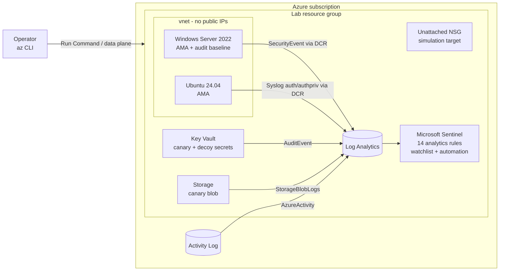

# Azure Detection Engineering Lab

[](https://github.com/H3llKa1ser/Azure-Detection-Engineering-Lab/actions/workflows/ci.yml)


A blue-team lab on Azure, built entirely with Terraform: Microsoft Sentinel,
instrumented victim hosts, honeytokens, **detections as code**, and an attack
simulation harness that proves every rule actually fires.

The loop this repo is built around:

```
write rule (YAML + KQL) ──► lint + KQL analysis in CI ──► terraform apply
        ▲                                                       │
        │                                                       ▼
   tune / fix  ◄── verify.sh: which rules fired? ◄── simulate/run-all.sh
```

Every detection ships with the script that generates its telemetry. A rule
without a working simulation is a rule you only *think* you have.

---

## Architecture



| Layer | What's deployed |
|---|---|
| SIEM | Log Analytics workspace (daily cap), Sentinel onboarding |
| Telemetry | Subscription Activity Log, Key Vault audit, Blob read/write/delete logs, Windows Security events and Linux auth syslog via Azure Monitor Agent + Data Collection Rules |
| Victims | Windows Server 2022 and Ubuntu 24.04, Trusted Launch, no public IPs, nightly auto-shutdown |
| Deception | Canary Key Vault secret, decoy secrets, canary "payroll export" blob |
| Detections | 14 scheduled analytics rules generated from YAML, mapped to MITRE ATT&CK, with entity mappings and custom details |
| Response | Watchlist allowlist, automation rule that labels every incident and attaches a triage task checklist |
| Simulation | Bash + az CLI scenarios, Windows/Linux attack chains via Run Command, `verify.sh` closes the loop |

## Detections

Full catalog with ATT&CK links: [`docs/detection-catalog.md`](docs/detection-catalog.md) (generated, checked in CI).

| ID | Detection | Sev | ATT&CK |
|---|---|---|---|
| AZ-ACT-001 | Privileged RBAC role assigned outside approved callers | High | T1098.003 |
| AZ-ACT-002 | Diagnostic setting deleted | High | T1562.008 |
| AZ-ACT-003 | NSG allows SSH/RDP/WinRM from the Internet | Medium | T1562.007, T1133 |
| AZ-ACT-004 | VM Run Command executed | Medium | T1651 |
| AZ-ACT-005 | Storage account keys listed by a user | Low | T1552.007 |
| KV-001 | Honeytoken secret read | High | T1555.006 |
| KV-002 | Bulk secret retrieval by one identity | Medium | T1555.006 |
| STG-001 | Honeytoken blob downloaded | High | T1530 |
| WIN-001 | Burst of failed logons | Medium | T1110.001 |
| WIN-002 | Successful logon after repeated failures | High | T1110.001, T1078.003 |
| WIN-003 | Member added to privileged group | Medium | T1098 |
| WIN-004 | Security event log cleared | High | T1070.001 |
| LNX-001 | SSH auth failure burst from one source | Medium | T1110.001, T1110.003 |
| LNX-002 | User added to root-equivalent group (sudo/wheel/docker/lxd) | Medium | T1136.001, T1098 |

## Quick start

**Prerequisites:** Terraform ≥ 1.9, Azure CLI (logged in with `az login`), bash + openssl
(Linux, macOS, WSL or Cloud Shell), and **Owner on a sandbox subscription**. Owner is
needed for the subscription Activity Log diagnostic setting and the role-assignment
simulation. Don't deploy this into a production subscription.

```bash
git clone https://github.com/H3llKa1ser/Azure-Detection-Engineering-Lab.git
cd Azure-Detection-Engineering-Lab

cp terraform/terraform.tfvars.example terraform/terraform.tfvars
# set subscription_id; everything else has sensible defaults

make init
make plan
make apply         # ~10-15 min; writes simulate/lab.env for the scenarios
```

Give the agents ~10 minutes to start shipping, then:

```bash
make simulate      # runs every scenario (~5 min)
# wait ~20-30 min for ingestion + rule schedules
make verify        # FIRED / MISSING per detection
```

Incidents appear in Sentinel (Azure portal, or the Defender portal if your tenant uses
the unified SecOps experience). Each one carries the `detection-lab` label and three
triage tasks.

```bash
make destroy       # when you're done - everything is disposable
```

## Adding a detection

1. Copy [`detections/_TEMPLATE.yaml.example`](detections/_TEMPLATE.yaml.example) to
   `detections/<area>/<id>-<slug>.yaml`.
2. Write the KQL. Use `${canary_secret_name}`, `${storage_name}` and the other
   placeholders for lab-specific names.
3. Add a scenario under `simulate/scenarios/` and reference it in `simulation:`.
4. `make lint && make test && make catalog`
5. `make apply`, run your scenario, `make verify`.

No Terraform changes are needed. The loader in [`terraform/detections.tf`](terraform/detections.tf)
picks up every YAML file and turns it into a Sentinel rule, skipping any whose
`requires:` data source is switched off (e.g. `deploy_windows_vm = false`).

## Quality gates (CI)

| Gate | What it catches |
|---|---|
| `scripts/validate_detections.py` | Schema, duplicate IDs, Sentinel limits (frequency/period bounds, entity and field-mapping counts), valid tactic names, ATT&CK ID formats, entity/custom-detail columns that don't exist in the query, missing simulation scripts, stale catalog |
| `scripts/kql/check.js` | **KQL syntax and semantic analysis** using Microsoft's `Kusto.Language` library against a declared table schema: unknown tables/columns, columns referenced after a `summarize` dropped them, type errors |
| `terraform test` | Offline plan tests with mocked providers: all 14 rules plan, host rules are skipped without VMs, firewalls default-deny, variable validation |
| `terraform fmt` / `validate`, `tflint` (+ azurerm ruleset) | Style, schema, retired VM sizes, invalid SKUs |
| Checkov | IaC misconfigurations; every skip is inline with a written justification |
| ShellCheck | Simulation scripts |

Run all of it locally with `make ci`.

## Design decisions and things I learned building it

**Honeytokens must be invisible to your own IaC.** The obvious way to create the
canary secret is `azurerm_key_vault_secret`, but Terraform refreshes it on every plan,
which is a `SecretGet`, which fires KV-001. Every `terraform plan` would page you,
and a honeytoken that pages you constantly gets ignored. The canaries are seeded
out-of-band by [`seed-honeytokens.sh`](terraform/scripts/seed-honeytokens.sh); their
values are generated in the shell and never touch Terraform state.

**Plan-time vs apply-time values in `for_each`.** Rule queries embed resource names
that contain a random suffix, so the rendered YAML is unknown until apply. Keying
`for_each` off the rendered document breaks `terraform plan` on a fresh workspace.
The loader decodes each file twice: raw (for ID, `requires`, `enabled`, known at plan)
and rendered (for the query and description). `terraform test` locks this in.

**`AzureDiagnostics` columns are created on first ingestion.** Sentinel validates a
rule's KQL against the workspace schema at creation time, so a Key Vault rule that
references `id_s` fails on a brand-new workspace. `column_ifexists()` keeps rules
deployable on day zero.

**Activity Log events come in pairs.** The request body (role definition, NSG rule
properties) is on the `Start` event, the outcome on `Success`. The AZ-ACT rules stitch
them by `CorrelationId` instead of assuming both are on one row.

**Simulate safely.** The NSG scenario edits an NSG that's attached to nothing; the
role-assignment scenario grants Owner to a throwaway managed identity and revokes it
after 30 s; the diagnostic-setting scenario deletes a temporary setting it just
created. Nothing real is ever exposed, and the lab's own logging is never touched.

**Some rules fire on your own tooling, and that's the point.** AZ-ACT-004 (Run Command)
fires on the Terraform-managed audit baseline and on every host simulation. That's
realistic: high-value control-plane rules need a baseline of known callers before they
go to production, which is what the watchlist pattern in AZ-ACT-001 demonstrates.

**azurerm 5.x changes.** The provider no longer auto-registers ~60 resource providers;
this lab registers exactly the 10 it needs. Key Vault now requires
`rbac_authorization_enabled`, and tflint's azurerm ruleset flagged the B-series v1
sizes as announced for retirement, so the default is `Standard_B2als_v2`.

## Cost

The VMs are the main cost. Both auto-shutdown nightly (`auto_shutdown_time`), and the
simulation scripts start them if needed. Log ingestion is tiny because the DCRs collect
only the event IDs and syslog facilities the rules use, and the workspace has a 1 GB/day
cap as a guardrail. Sentinel bills per GB ingested; new workspaces have historically had
a free trial period, so check current terms. Use the
[Azure pricing calculator](https://azure.microsoft.com/pricing/calculator/) for your
region, and `make destroy` at the end of each session.

Set `deploy_windows_vm = false` and `deploy_linux_vm = false` for a near-zero-cost,
cloud-only lab (8 detections: Activity Log, Key Vault, Storage).

## Security notes

* No public IPs. Hosts are driven through VM Run Command (Azure RBAC), not SSH/RDP.
* Key Vault and Storage firewalls default-deny and allow only your egress IP
  (auto-detected, or set `operator_ip`).
* Shared-key auth is disabled on the storage account; everything uses Entra ID.
* The Windows admin password is generated by Terraform and stored in the vault.
* `simulate/lab.env` contains resource names only, no secrets, and is gitignored.

## Troubleshooting

| Symptom | Fix |
|---|---|
| 403 writing secrets/blob on first apply | RBAC propagation lag; re-run `make apply` (a 90 s wait is built in, but tenants vary) |
| Rule creation fails with "table/column does not exist" | Tables can appear only after first ingestion; wait a few minutes and re-apply |
| No `SecurityEvent`/`Syslog` data | Check the AMA extension status on the VM and that the subnet has egress; set `use_nat_gateway = true` if default outbound access isn't available in your subscription |
| `verify.sh` shows MISSING | Check ingestion first (`AzureDiagnostics \| take 1`, `SecurityEvent \| take 1`), then the rule's health in Sentinel > Analytics. Host rules show MISSING if that VM isn't deployed |
| Role-assignment scenario fails | Your account needs Owner or User Access Administrator on the lab resource group |

## Repo layout

```
.
├── detections/                 # detection-as-code: one YAML per rule
│   ├── azure-activity/  keyvault/  storage/  windows/  linux/
│   └── _TEMPLATE.yaml.example
├── simulate/
│   ├── scenarios/              # one script per detection (or chain)
│   ├── payloads/               # PowerShell / bash executed via Run Command
│   ├── run-all.sh  verify.sh
│   └── lib/common.sh
├── terraform/
│   ├── monitoring.tf           # Log Analytics, Sentinel, Activity Log
│   ├── network.tf  compute.tf  dcr.tf
│   ├── canaries.tf             # Key Vault, Storage, honeytoken seeding
│   ├── detections.tf           # YAML -> Sentinel rule loader
│   ├── sentinel.tf             # watchlist, automation rule
│   ├── tests/plan.tftest.hcl   # offline plan tests
│   └── scripts/seed-honeytokens.sh
├── scripts/
│   ├── validate_detections.py  # lint + catalog generator
│   └── kql/                    # Kusto.Language semantic checker + schema
├── docs/detection-catalog.md   # generated
└── .github/workflows/ci.yml
```

## Roadmap

- [ ] Entra ID sign-in/audit logs (requires P1/P2) and identity detections
- [ ] VNet flow logs + Traffic Analytics, network detections
- [ ] Logic App playbook: auto-disable principal on KV-001 / STG-001
- [ ] Sysmon on the Windows host
- [ ] Atomic Red Team integration for broader technique coverage
- [ ] Remote state backend + GitHub Actions OIDC deployment

## Disclaimer

For learning and portfolio use in a subscription you own. Simulations generate
attacker-like activity against lab resources only. Not affiliated with Microsoft.

## License

MIT
