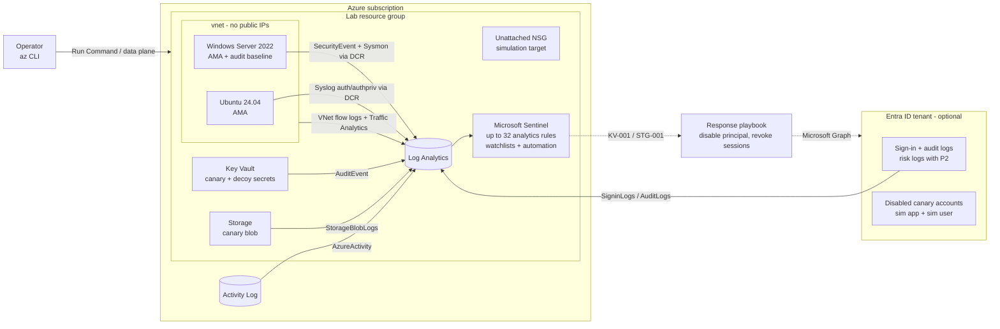

# Azure Detection Engineering Lab

[](https://github.com/H3llKa1ser/Azure-Detection-Engineering-Lab/actions/workflows/ci.yml)
[](https://github.com/H3llKa1ser/Azure-Detection-Engineering-Lab/actions/workflows/deploy.yml)


A blue-team lab on Azure, built entirely with Terraform: Microsoft Sentinel,
instrumented victim hosts, Entra ID identity telemetry, VNet flow logs,
honeytokens, Sysmon endpoint
telemetry, Atomic Red Team coverage, **detections as code**, and an attack simulation harness that proves every
rule actually fires.

The loop this repo is built around:

```
write rule (YAML + KQL) ──► lint + KQL analysis in CI ──► terraform apply
        ▲                                                       │
        │                                                       ▼
   tune / fix  ◄── verify.sh: which rules fired? ◄── simulate/run-all.sh
```

Every detection ships with the script that generates its telemetry. A rule
without a working simulation is a rule you only *think* you have.

---

## Architecture



| Layer | What's deployed |
|---|---|
| SIEM | Log Analytics workspace (daily cap), Sentinel onboarding |
| Telemetry | Subscription Activity Log, Key Vault audit, Blob read/write/delete logs, Windows Security events and Linux auth syslog via Azure Monitor Agent + Data Collection Rules, and optionally Entra ID sign-in/audit/risk logs and VNet flow logs enriched by Traffic Analytics |
| Victims | Windows Server 2022 (optionally with Sysmon) and Ubuntu 24.04, Trusted Launch, no public IPs, nightly auto-shutdown |
| Deception | Canary Key Vault secret, decoy secrets, canary "payroll export" blob, and (Entra layer) disabled canary user accounts |
| Detections | 32 scheduled analytics rules generated from YAML (14 core + 7 identity + 5 network + 6 Sysmon endpoint), mapped to MITRE ATT&CK, with entity mappings, custom details and dynamic severity |
| Response | Allowlist and honeytoken watchlists, automation rule that labels every incident and attaches a triage task checklist, and an optional SOAR playbook that auto-disables the principal on a honeytoken hit |
| Simulation | Bash + az CLI scenarios, Windows/Linux attack chains via Run Command, `verify.sh` closes the loop |
| Technique coverage | Atomic Red Team tests mapped to detections (`simulate/atomic/`), validated against the detection library in CI |

## Detections

Full catalog with ATT&CK links: [`docs/detection-catalog.md`](docs/detection-catalog.md) (generated, checked in CI).

| ID | Detection | Sev | ATT&CK |
|---|---|---|---|
| AZ-ACT-001 | Privileged RBAC role assigned outside approved callers | High | T1098.003 |
| AZ-ACT-002 | Diagnostic setting deleted | High | T1562.008 |
| AZ-ACT-003 | NSG allows SSH/RDP/WinRM from the Internet | Medium | T1562.007, T1133 |
| AZ-ACT-004 | VM Run Command executed | Medium | T1651 |
| AZ-ACT-005 | Storage account keys listed by a user | Low | T1552.007 |
| KV-001 | Honeytoken secret read | High | T1555.006 |
| KV-002 | Bulk secret retrieval by one identity | Medium | T1555.006 |
| STG-001 | Honeytoken blob downloaded | High | T1530 |
| WIN-001 | Burst of failed logons | Medium | T1110.001 |
| WIN-002 | Successful logon after repeated failures | High | T1110.001, T1078.003 |
| WIN-003 | Member added to privileged group | Medium | T1098 |
| WIN-004 | Security event log cleared | High | T1070.001 |
| LNX-001 | SSH auth failure burst from one source | Medium | T1110.001, T1110.003 |
| LNX-002 | User added to root-equivalent group (sudo/wheel/docker/lxd) | Medium | T1136.001, T1098 |
| ENT-001 | Password spray from a single IP (High if a sprayed account then signed in) | Med/High | T1110.003 |
| ENT-002 | Sign-in attempt against a honeytoken account | High | T1078.004 |
| ENT-003 | Credential added to app / service principal | Medium | T1098.001 |
| ENT-004 | Privileged Entra directory role assigned (incl. PIM) | High | T1098.003 |
| ENT-005 | Conditional Access policy changed (High on delete/disable) | Low-High | T1556.009 |
| ENT-006 | High-risk Graph permission granted to an app | High | T1528, T1098.003 |
| ENT-007 | Identity Protection medium/high risk (P2) | Med/High | T1078.004 |
| NET-001 | Vertical port scan (one source, many ports) | Medium | T1046 |
| NET-002 | Horizontal host sweep (one source, many hosts) | Medium | T1046, T1018 |
| NET-003 | East-west connection to management ports | High | T1021 |
| NET-004 | Traffic Analytics flagged a malicious flow | High | T1071 |
| NET-005 | Large outbound data transfer to an external IP | Medium | T1048.003 |
| SYS-001 | Suspicious LOLBin process creation | High | T1218, T1059.001 |
| SYS-002 | LSASS access with credential-dumping rights | High | T1003.001 |
| SYS-003 | Network connection from a LOLBin / interpreter | Medium | T1105 |
| SYS-004 | Registry Run-key persistence | Medium | T1547.001 |
| SYS-005 | Remote thread created in another process | High | T1055.002 |
| SYS-006 | Sysmon config change / service tampering | High | T1562.001 |

The ENT rules are deployed only with `enable_entra_id = true` (ENT-007 also needs
`entra_id_p2 = true`). Prerequisites, required roles and simulation safety tiers
are in [`docs/entra-id.md`](docs/entra-id.md).

The NET rules are deployed only with `enable_flow_logs = true`. They read the
`NTANetAnalytics` table produced by VNet flow logs + Traffic Analytics; see
[`docs/network-detections.md`](docs/network-detections.md) for cost, the 10-60 min
processing latency, and the lateral-movement baseline NET-003 assumes.

The SYS rules are deployed only with `enable_sysmon = true` (needs the Windows
VM). They read Sysmon events from the `Event` table; see [`docs/sysmon.md`](docs/sysmon.md)
for the config, the EventData parsing approach, and which simulations are safe.

## Quick start

**Prerequisites:** Terraform ≥ 1.9, Azure CLI (logged in with `az login`), bash + openssl
(Linux, macOS, WSL or Cloud Shell), and **Owner on a sandbox subscription**. Owner is
needed for the subscription Activity Log diagnostic setting and the role-assignment
simulation. Don't deploy this into a production subscription.

```bash
git clone https://github.com/H3llKa1ser/Azure-Detection-Engineering-Lab.git
cd Azure-Detection-Engineering-Lab

cp terraform/terraform.tfvars.example terraform/terraform.tfvars
# set subscription_id; everything else has sensible defaults

make init
make plan
make apply         # ~10-15 min; writes simulate/lab.env for the scenarios
```

Give the agents ~10 minutes to start shipping, then:

```bash
make simulate      # runs every scenario (~5 min)
# wait ~20-30 min for ingestion + rule schedules
make verify        # FIRED / MISSING per detection
```

To add the identity layer, set `enable_entra_id = true` (and `entra_id_p2 = true`
on a P2 tenant) and re-apply; see [`docs/entra-id.md`](docs/entra-id.md) first.
To add network detections, set `enable_flow_logs = true` and re-apply; see
[`docs/network-detections.md`](docs/network-detections.md) (expect 30-75 min
before flow-log alerts appear). To add Sysmon endpoint detections, set
`enable_sysmon = true` and re-apply; see [`docs/sysmon.md`](docs/sysmon.md). To add
the auto-disable SOAR playbook, set `enable_response_playbook = true` (dry-run by
default); see [`docs/response-playbook.md`](docs/response-playbook.md).
The scenarios that temporarily change tenant objects only run when you opt in:

```bash
ALLOW_TENANT_CHANGES=1 make simulate
```

Incidents appear in Sentinel (Azure portal, or the Defender portal if your tenant uses
the unified SecOps experience). Each one carries the `detection-lab` label and three
triage tasks.

```bash
make destroy       # when you're done - everything is disposable
```

To deploy from GitHub Actions instead (secretless OIDC, remote state, apply gated
by an environment reviewer), run `make bootstrap` once and follow
[`docs/remote-state-and-oidc.md`](docs/remote-state-and-oidc.md).

To broaden technique coverage with Atomic Red Team (purple-team style - fire a
real technique, confirm the rule alerts):

```bash
./simulate/atomic/install-atomics.sh                                  # one-time
ALLOW_ATOMIC_TESTS=1 ./simulate/atomic/run-atomics.sh --risk safe     # opt-in, lab only
make verify
```

See [`docs/atomic-red-team.md`](docs/atomic-red-team.md) for the coverage map, GUID
pinning and risk tiers.

## Adding a detection

1. Copy [`detections/_TEMPLATE.yaml.example`](detections/_TEMPLATE.yaml.example) to
   `detections/<area>/<id>-<slug>.yaml`.
2. Write the KQL. Use `${canary_secret_name}`, `${storage_name}` and the other
   placeholders for lab-specific names.
3. Add a scenario under `simulate/scenarios/` and reference it in `simulation:`.
4. `make lint && make test && make catalog`
5. `make apply`, run your scenario, `make verify`.

No Terraform changes are needed. The loader in [`terraform/detections.tf`](terraform/detections.tf)
picks up every YAML file and turns it into a Sentinel rule, skipping any whose
`requires:` data source is switched off (e.g. `deploy_windows_vm = false`).

## Quality gates (CI)

| Gate | What it catches |
|---|---|
| `scripts/validate_detections.py` | Schema, duplicate IDs, Sentinel limits (frequency/period bounds, entity and field-mapping counts), valid tactic names, ATT&CK ID formats, entity/custom-detail columns that don't exist in the query, missing simulation scripts, stale catalog |
| Playbook ARM templates | Validated as JSON in CI (`terraform/playbooks/*.json`) |
| Bootstrap `terraform test` | State storage hardening, exact OIDC subjects, RBAC Administrator constrained by ABAC to the lab's four roles |
| actionlint | Workflow syntax, expression types, and shellcheck over every `run:` block |
| `scripts/validate_atomics.py` | Atomic Red Team map: every entry ties to a real detection and a technique it declares; reports endpoint coverage |
| `scripts/kql/check.js` | **KQL syntax and semantic analysis** using Microsoft's `Kusto.Language` library against a declared table schema: unknown tables/columns, columns referenced after a `summarize` dropped them, type errors |
| `terraform test` | Offline plan tests with mocked providers: correct rule counts for every data-source combination (core 14, no-VM 8, +network 19, +sysmon 20, +Entra 20/21), Sysmon collected into the Event table and gated on the Windows VM, canary accounts disabled and on the watchlist, VNet flow log targets the VNet, no optional resources unless opted in, firewalls default-deny, variable validation |
| `terraform fmt` / `validate`, `tflint` (+ azurerm ruleset) | Style, schema, retired VM sizes, invalid SKUs |
| Checkov | IaC misconfigurations; every skip is inline with a written justification |
| ShellCheck | Simulation scripts |

Run all of it locally with `make ci`.

## Design decisions and things I learned building it

**Honeytokens must be invisible to your own IaC.** The obvious way to create the
canary secret is `azurerm_key_vault_secret`, but Terraform refreshes it on every plan,
which is a `SecretGet`, which fires KV-001. Every `terraform plan` would page you,
and a honeytoken that pages you constantly gets ignored. The canaries are seeded
out-of-band by [`seed-honeytokens.sh`](terraform/scripts/seed-honeytokens.sh); their
values are generated in the shell and never touch Terraform state.

**Plan-time vs apply-time values in `for_each`.** Rule queries embed resource names
that contain a random suffix, so the rendered YAML is unknown until apply. Keying
`for_each` off the rendered document breaks `terraform plan` on a fresh workspace.
The loader decodes each file twice: raw (for ID, `requires`, `enabled`, known at plan)
and rendered (for the query and description). `terraform test` locks this in.

**`AzureDiagnostics` columns are created on first ingestion.** Sentinel validates a
rule's KQL against the workspace schema at creation time, so a Key Vault rule that
references `id_s` fails on a brand-new workspace. `column_ifexists()` keeps rules
deployable on day zero.

**Activity Log events come in pairs.** The request body (role definition, NSG rule
properties) is on the `Start` event, the outcome on `Success`. The AZ-ACT rules stitch
them by `CorrelationId` instead of assuming both are on one row.

**Simulate safely.** The NSG scenario edits an NSG that's attached to nothing; the
role-assignment scenario grants Owner to a throwaway managed identity and revokes it
after 30 s; the diagnostic-setting scenario deletes a temporary setting it just
created. Nothing real is ever exposed, and the lab's own logging is never touched.

**Some rules fire on your own tooling, and that's the point.** AZ-ACT-004 (Run Command)
fires on the Terraform-managed audit baseline and on every host simulation. That's
realistic: high-value control-plane rules need a baseline of known callers before they
go to production, which is what the watchlist pattern in AZ-ACT-001 demonstrates.

**Identity simulations get blast-radius tiers.** Sign-in scenarios only throw
random wrong passwords at *disabled* canary accounts. Anything that changes the
tenant (a secret, a role, a CA policy, an app permission) needs
`ALLOW_TENANT_CHANGES=1`, targets only lab-owned disabled or credential-less
objects, and reverts itself within ~30 s.

**One rule, different urgencies.** A Conditional Access policy being created and
one being deleted are the same detection but not the same page. ENT-005 computes
an `AlertSeverity` column and the loader wires it to Sentinel's
`alert_details_override`, which the validator checks (the column must exist, and
custom alert names must keep the `[ID]` prefix `verify.sh` relies on).

**Secretless deployment with a pipeline that can't escalate.** GitHub Actions
deploys via OIDC workload identity federation, so there's no client secret to
leak. Three exact-match federated subjects separate trust levels: a PR token can
only plan, and apply/destroy need the protected `lab` environment. The pipeline
gets Contributor plus RBAC Administrator *constrained by an ABAC condition* to
the four roles the lab itself assigns, so it can wire up the lab but can never
grant Owner, to itself or anyone.

**Atomic Red Team is mapped, not bolted on.** Rather than "run every atomic",
`simulate/atomic/atomic-map.yaml` ties each test to the detection it should
trigger, and `scripts/validate_atomics.py` fails CI if an entry names a
detection that doesn't exist or a technique that detection doesn't declare - so
a green atomic run means *your* rules fired. Tests are pinned by
`auto_generated_guid` (stable; test numbers aren't), and unverified ones are
left unpinned so the map never claims a test identity it hasn't confirmed.

**SOAR response ships in dry-run.** The auto-disable playbook (KV-001 / STG-001 ->
disable the Entra ID principal) defaults to commenting *"would disable X"* instead
of acting, and the Graph permission that lets it actually disable a user is a
separate opt-in. You roll it out in stages - deploy, watch it identify the right
principal on a real incident, then enforce - which is how you'd introduce any
automatic containment without it becoming its own denial-of-service.

**Sysmon lands in `Event`, not `SecurityEvent`.** AMA collects the Sysmon
operational channel through the `Microsoft-Event` stream, so the SYS-* rules
query the `Event` table and pull fields out of the `EventData` XML with
`extract()`. The config is intentionally compact - it logs only the event types
the rules use - and `sysmon_config_url` swaps in a fuller one.

**VNet flow logs, not NSG flow logs.** Microsoft retired NSG flow logs in June
2025. This lab uses VNet flow logs, which attach to the virtual network and
cover every NIC in it, and reads the `NTANetAnalytics` table that Traffic
Analytics produces (the older `AzureNetworkAnalytics_CL` is gone). Flow-log
storage is a separate account from the canary so its writes never show up in the
STG-001 honeytoken telemetry.

**azurerm 5.x changes.** The provider no longer auto-registers ~60 resource providers;
this lab registers exactly the 10 it needs. Key Vault now requires
`rbac_authorization_enabled`, and tflint's azurerm ruleset flagged the B-series v1
sizes as announced for retirement, so the default is `Standard_B2als_v2`.

## Cost

The VMs are the main cost. Both auto-shutdown nightly (`auto_shutdown_time`), and the
simulation scripts start them if needed. Log ingestion is tiny because the DCRs collect
only the event IDs and syslog facilities the rules use, and the workspace has a 1 GB/day
cap as a guardrail. Sentinel bills per GB ingested; new workspaces have historically had
a free trial period, so check current terms. Use the
[Azure pricing calculator](https://azure.microsoft.com/pricing/calculator/) for your
region, and `make destroy` at the end of each session.

Set `deploy_windows_vm = false` and `deploy_linux_vm = false` for a near-zero-cost,
cloud-only lab (8 detections: Activity Log, Key Vault, Storage).

The optional layers add cost: Entra ID needs P1/P2 licensing, Traffic Analytics
(`enable_flow_logs`) bills for flow-log ingestion and processing, and Sysmon
(`enable_sysmon`) adds `Event`-table ingestion - leave them off unless you're
exercising them.

## Security notes

* No public IPs. Hosts are driven through VM Run Command (Azure RBAC), not SSH/RDP.
* Key Vault and Storage firewalls default-deny and allow only your egress IP
  (auto-detected, or set `operator_ip`).
* Shared-key auth is disabled on the storage account; everything uses Entra ID.
* The Windows admin password is generated by Terraform and stored in the vault.
* `simulate/lab.env` contains resource names only, no secrets, and is gitignored.

## Troubleshooting

| Symptom | Fix |
|---|---|
| 403 writing secrets/blob on first apply | RBAC propagation lag; re-run `make apply` (a 90 s wait is built in, but tenants vary) |
| Rule creation fails with "table/column does not exist" | Tables can appear only after first ingestion; wait a few minutes and re-apply |
| No `SecurityEvent`/`Syslog` data | Check the AMA extension status on the VM and that the subnet has egress; set `use_nat_gateway = true` if default outbound access isn't available in your subscription |
| `verify.sh` shows MISSING | Check ingestion first (`AzureDiagnostics \| take 1`, `SecurityEvent \| take 1`), then the rule's health in Sentinel > Analytics. Host rules show MISSING if that VM isn't deployed |
| Role-assignment scenario fails | Your account needs Owner or User Access Administrator on the lab resource group |
| ENT-003..006 show MISSING | They only run with `ALLOW_TENANT_CHANGES=1`; a 403 from Graph means the CLI token or your Entra role is insufficient (see [`docs/entra-id.md`](docs/entra-id.md)) |
| NET-* show MISSING | Traffic Analytics adds 10-60 min processing latency; wait 30-75 min and confirm the `NTANetAnalytics` table has data. NET-004 is not auto-simulated |
| SYS-* show MISSING | Confirm the `Event` table has `Source == "Microsoft-Windows-Sysmon"` rows; if not, check the install-sysmon Run Command output and that the VM had egress to download Sysmon. SYS-005 is not auto-simulated |
| deploy jobs all show "skipped" | Expected until the bootstrap repo variables are set (`make bootstrap`, then the printed `gh variable set` commands) |
| deploy `apply` fails on a role assignment | The ABAC condition only allows the lab's four roles; if you add a layer that assigns a new role, add it to `delegable_roles` in `terraform/bootstrap/main.tf` and re-apply bootstrap |
| Simulations get 403 after a CI deploy | Your IP isn't in `OPERATOR_ALLOWED_IPS`; the runner's IP was used as `operator_ip` |
| Playbook comments "no Account entity found" | The incident carried no Account entity - set `enable_entra_id = true` so there's a user to act on, and confirm the detection's entity mappings. Validate in dry-run before enforcing |
| Graph app-role assignment fails on apply | Assigning `User.ReadWrite.All` needs Privileged Role Administrator / Global Administrator; run that apply as such, or leave `playbook_grant_graph = false` and stay in dry-run |

## Repo layout

```
.
├── detections/                 # detection-as-code: one YAML per rule
│   ├── azure-activity/  keyvault/  storage/  windows/  linux/
│   ├── entra-id/  network/  sysmon/
│   └── _TEMPLATE.yaml.example
├── simulate/
│   ├── scenarios/              # one script per detection (or chain)
│   ├── payloads/               # PowerShell / bash executed via Run Command
│   ├── atomic/                 # Atomic Red Team map + install/run scripts
│   ├── run-all.sh  verify.sh
│   └── lib/common.sh
├── terraform/
│   ├── monitoring.tf           # Log Analytics, Sentinel, Activity Log
│   ├── network.tf  compute.tf  dcr.tf
│   ├── canaries.tf             # Key Vault, Storage, honeytoken seeding
│   ├── entra.tf                # Entra ID logs, canary accounts, sim targets
│   ├── netwatch.tf             # VNet flow logs + Traffic Analytics
│   ├── sysmon.tf               # Sysmon install + DCR into the Event table
│   ├── response.tf             # auto-disable playbook, RBAC, automation rule
│   ├── playbooks/              # Logic App ARM templates
│   ├── detections.tf           # YAML -> Sentinel rule loader
│   ├── sentinel.tf             # watchlist, automation rule
│   ├── tests/plan.tftest.hcl   # offline plan tests
│   ├── bootstrap/              # one-time: remote state + GitHub OIDC identity
│   ├── backend.hcl.example     # remote-state config for local use
│   └── scripts/seed-honeytokens.sh
├── scripts/
│   ├── validate_detections.py  # lint + catalog generator
│   ├── validate_atomics.py     # Atomic Red Team coverage map validator
│   └── kql/                    # Kusto.Language semantic checker + schema
├── docs/
│   ├── detection-catalog.md    # generated
│   ├── remote-state-and-oidc.md  # bootstrap, OIDC subjects, least-privilege RBAC
│   ├── entra-id.md             # identity layer: prerequisites, roles, safety
│   ├── network-detections.md   # flow logs: cost, latency, tuning
│   ├── sysmon.md               # Sysmon: config, EventData parsing, safety
│   ├── response-playbook.md    # SOAR playbook: dry-run model, Graph grant
│   └── atomic-red-team.md      # ART map, GUID pinning, risk tiers
└── .github/
    ├── workflows/ci.yml  deploy.yml
    └── scripts/wire-backend.sh
```

## Roadmap

- [x] Entra ID sign-in/audit/risk logs and identity detections ([docs](docs/entra-id.md))
- [x] VNet flow logs + Traffic Analytics, network detections ([docs](docs/network-detections.md))
- [x] Logic App playbook: auto-disable principal on KV-001 / STG-001 ([docs](docs/response-playbook.md))
- [x] Sysmon on the Windows host ([docs](docs/sysmon.md))
- [x] Atomic Red Team integration for broader technique coverage ([docs](docs/atomic-red-team.md))
- [x] Remote state backend + GitHub Actions OIDC deployment ([docs](docs/remote-state-and-oidc.md))

## Disclaimer

For learning and portfolio use in a subscription you own. Simulations generate
attacker-like activity against lab resources only. Not affiliated with Microsoft.

## License

MIT
